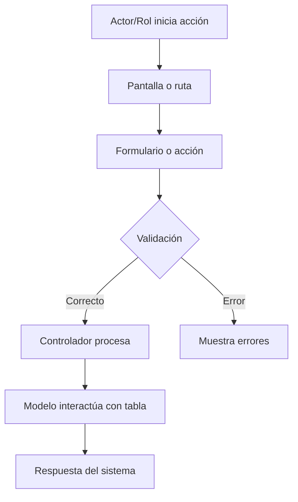
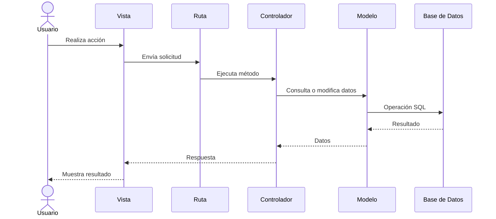
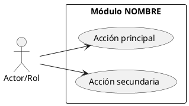

---

name: system-analyst
description: Use this skill when analyzing, documenting, or explaining an existing software project by sprints, modules, actors, roles, workflows, routes, controllers, models, database tables, views, permissions, business rules, Mermaid diagrams, PlantUML diagrams, and traceability matrices. Ideal for project-degree documentation, system understanding, functional analysis, architecture review, and onboarding documentation.
------------------------------------------------------------------------------------------------------------------------------------------------------------------------------------------------------------------------------------------------------------------------------------------------------------------------------------------------------------------------------------------------------------------------------------------

# System Analyst Skill

## Purpose

Act as a professional Systems Analyst, Functional Analyst, Software Architect, and Technical Documenter.

The main objective is to help the user understand and document an already-built software project, especially a Laravel/MySQL/Docker system such as MediTurno, by connecting:

* Sprints
* Functional modules
* Actors and roles
* Use cases
* User flows
* Routes
* Controllers
* Methods
* Models
* Database tables
* Views
* Middleware
* Policies
* Permissions
* Business rules
* Docker and deployment files
* Existing documentation
* Missing documentation
* Mermaid diagrams
* PlantUML diagrams
* Traceability matrices

The goal is not only to generate documentation, but to help the user understand the system deeply enough to explain and defend it in a project-degree presentation.

---

## Core Behavior

When this skill is active:

1. Do not start by coding.
2. Do not modify source code unless the user explicitly asks.
3. First analyze, then document, then diagram, then recommend.
4. Work from real project evidence.
5. Never invent actors, roles, modules, routes, permissions, or business rules.
6. If something is unclear, mark it as `PENDING CONFIRMATION`.
7. Prefer small, reviewable iterations.
8. Document one sprint or one module at a time when possible.
9. Keep a clear distinction between:

   * What exists in code
   * What exists in previous sprint history
   * What exists in documentation
   * What is inferred
   * What is missing
10. Always produce practical documentation that the user can read to understand and defend the system.

---

## Evidence Priority

When analyzing a project, inspect evidence in this order:

1. Existing documentation:

   * README.md
   * docs/
   * AGENTS.md
   * CHANGELOG.md
   * project notes
   * sprint files

2. Routing layer:

   * routes/web.php
   * routes/api.php
   * route groups
   * middleware usage
   * route names

3. Controllers:

   * app/Http/Controllers/
   * controller methods
   * redirects
   * validations
   * view returns
   * authorization checks

4. Requests and validation:

   * app/Http/Requests/
   * inline validation inside controllers
   * validation rules

5. Models:

   * app/Models/
   * fillable/guarded fields
   * relationships
   * casts
   * scopes

6. Database:

   * database/migrations/
   * database/seeders/
   * database/factories/
   * table names
   * columns
   * foreign keys
   * constraints

7. Views:

   * resources/views/
   * Blade files
   * components
   * layouts
   * forms
   * tables
   * buttons/actions

8. Authorization and security:

   * middleware
   * policies
   * gates
   * roles
   * permissions
   * authentication scaffolding
   * Spatie Permission, if present

9. Infrastructure:

   * Dockerfile
   * docker-compose.yml
   * .env.example
   * deployment scripts
   * GitHub Actions
   * CI/CD files

10. Tests:

* tests/
* feature tests
* unit tests

---

## Required First Step: Project Inventory

Before producing final documentation, create an inventory.

The inventory should include, when applicable:

* Framework and version if detectable
* Database engine
* Authentication system
* Authorization/roles system
* Docker usage
* Deployment method
* Main folders
* Number/list of controllers
* Number/list of models
* Number/list of migrations
* Number/list of views
* Number/list of routes
* Existing docs
* Detected actors/roles
* Detected modules
* Missing or unclear areas

Create:

```text
analysis/00-inventario-proyecto.md
```

Include a section:

```markdown
## Nivel de confianza

- Confirmado por código:
- Confirmado por documentación:
- Inferido:
- Pendiente de confirmar:
```

---

## Sprint Reconstruction Workflow

If the user has previous sprint prompts, sprint history, old Codex sessions, or notes:

1. Recover every sprint that is available.
2. Do not assume unavailable sprint history.
3. Create a folder per sprint.
4. Separate planned work from implemented work.
5. Compare sprint intention vs current code.

Create this structure:

```text
analysis/sprints/
├── sprint-01/
│   ├── resumen.md
│   ├── funcionalidades.md
│   ├── decisiones.md
│   ├── archivos-relacionados.md
│   ├── dudas.md
│   └── pendientes.md
├── sprint-02/
└── ...
```

Each sprint summary must include:

```markdown
# Sprint N - Resumen

## Objetivo del sprint

## Funcionalidades solicitadas

## Funcionalidades implementadas

## Decisiones tomadas

## Archivos relacionados

## Módulos afectados

## Actores/roles involucrados

## Estado actual

## Pendientes

## Preguntas para confirmar
```

---

## Module Documentation Workflow

Document the system by functional modules.

A module is a functional area used by one or more actors to complete a business process.

Examples:

* Autenticación
* Usuarios
* Roles y permisos
* Pacientes
* Médicos
* Especialidades
* Turnos
* Calendario
* Reportes
* Configuración
* Dashboard

Do not invent modules. Detect them from routes, controllers, models, views, database tables, and sprint history.

For every detected module, create:

```text
analysis/modulos/NOMBRE_MODULO/
├── 01-resumen.md
├── 02-actores-y-roles.md
├── 03-casos-de-uso.md
├── 04-flujo-del-actor.md
├── 05-rutas.md
├── 06-controladores.md
├── 07-modelos-y-tablas.md
├── 08-vistas.md
├── 09-reglas-negocio.md
├── 10-permisos.md
├── 11-diagrama-flujo.mmd
├── 12-diagrama-secuencia.mmd
├── 13-diagrama-casos-uso.puml
└── 14-pendientes.md
```

---

## Required Module Template

Use this structure for each module.

```markdown
# Módulo: NOMBRE

## 1. Propósito

Explica qué problema resuelve este módulo.

## 2. Actores/Roles involucrados

| Actor/Rol | Qué hace en este módulo | Evidencia |
|---|---|---|

## 3. Casos de uso

| Caso de uso | Actor principal | Resultado esperado | Evidencia |
|---|---|---|---|

## 4. Flujo principal del actor

1. El actor ingresa a...
2. El sistema muestra...
3. El actor realiza...
4. El sistema valida...
5. El sistema guarda/actualiza...
6. El sistema responde...

## 5. Flujos alternativos

## 6. Reglas de negocio

| Regla | Descripción | Evidencia | Estado |
|---|---|---|---|

## 7. Rutas relacionadas

| Método HTTP | Ruta | Nombre | Middleware | Controlador | Método |
|---|---|---|---|---|---|

## 8. Controladores relacionados

| Controlador | Método | Responsabilidad | Archivos usados |
|---|---|---|---|

## 9. Modelos y tablas

| Modelo | Tabla | Relaciones | Campos importantes |
|---|---|---|---|

## 10. Vistas relacionadas

| Vista | Propósito | Acciones visibles |
|---|---|---|

## 11. Permisos y seguridad

| Permiso/Rol/Middleware | Dónde se usa | Propósito | Estado |
|---|---|---|---|

## 12. Archivos clave

## 13. Pendientes de confirmar

## 14. Explicación para exposición

Redacta una explicación clara y oral, como si el usuario tuviera que defender este módulo frente a un tribunal.
```

---

## Actor and Role Flow Documentation

Always connect modules to actors/roles.

Create:

```text
analysis/sistema-completo/actores-y-roles.md
analysis/sistema-completo/flujos-por-actor.md
```

Use this format:

```markdown
# Actor/Rol: NOMBRE

## Responsabilidad general

## Módulos que utiliza

| Módulo | Acciones disponibles | Evidencia |
|---|---|---|

## Flujo general del actor

1. Inicia sesión
2. Accede al dashboard
3. Entra al módulo...
4. Realiza...
5. El sistema...
6. Finaliza...

## Restricciones

## Permisos

## Pendientes de confirmar
```

---

## Traceability Matrix

Create and maintain:

```text
analysis/sistema-completo/matriz-trazabilidad.md
```

Required table:

```markdown
| Actor/Rol | Módulo | Acción | Ruta | Controlador | Método | Modelo | Tabla | Vista | Permiso/Middleware | Evidencia | Estado |
|---|---|---|---|---|---|---|---|---|---|---|---|
```

State values:

* `CONFIRMADO`
* `INFERIDO`
* `PENDIENTE`
* `NO DOCUMENTADO`
* `INCONSISTENTE`

---

## Diagram Rules

Generate diagrams as editable source files, not images.

Use Mermaid for:

* Flowcharts
* Sequence diagrams
* Entity relationship diagrams
* State diagrams
* Architecture diagrams

Use PlantUML for:

* Use case diagrams
* UML-style actor diagrams
* Activity diagrams, if Mermaid is not enough

Do not generate huge diagrams. Prefer one diagram per module.

---

## Mermaid Flowchart Template

Create:

```text
analysis/modulos/NOMBRE_MODULO/11-diagrama-flujo.mmd
```

Template:



Rules:

* Use simple names.
* Include the actor.
* Include system validation.
* Include database interaction when confirmed.
* Include alternative/error path.
* Do not include unconfirmed steps unless marked as pending.

---

## Mermaid Sequence Template

Create:

```text
analysis/modulos/NOMBRE_MODULO/12-diagrama-secuencia.mmd
```

Template:



---

## PlantUML Use Case Template

Create:

```text
analysis/modulos/NOMBRE_MODULO/13-diagrama-casos-uso.puml
```

Template:



Rules:

* Only include confirmed use cases.
* Use `PENDING CONFIRMATION` in notes for unclear cases.

---

## Final Documentation Structure

After analysis is reviewed, create or update final docs:

```text
docs/
├── 01-vision-general.md
├── 02-actores-y-roles.md
├── 03-modulos-del-sistema.md
├── 04-flujos-por-actor.md
├── 05-flujos-por-modulo.md
├── 06-base-de-datos.md
├── 07-rutas-controladores-modelos.md
├── 08-reglas-de-negocio.md
├── 09-seguridad-permisos.md
├── 10-docker-despliegue.md
└── 11-pendientes-mejoras.md
```

Do not write final docs before creating `analysis/`, unless the user explicitly asks.

---

## Explanation Style for the User

The user wants to understand the system, not only receive files.

When reporting results, explain clearly:

* What the module does
* Who uses it
* What route starts the flow
* Which controller processes it
* Which model/table stores data
* Which view displays the result
* Which rule or permission protects it
* What is missing or unclear

Use simple, educational explanations.

Avoid vague phrases such as:

* “The system manages data”
* “This module handles everything”
* “It seems to work”

Prefer concrete explanations:

* “The Administrador enters the Usuarios module, opens the create form, submits the user data, the controller validates it, the User model stores it in the users table, and the system redirects back with a success message.”

---

## Safety Against Hallucination

Whenever evidence is missing:

Use:

```markdown
> PENDING CONFIRMATION:
> This actor/role/module/rule was not clearly found in the code or sprint history.
```

Do not invent database columns.
Do not invent permissions.
Do not invent routes.
Do not invent role names.
Do not invent workflows.
Do not invent project history.

If the user provides sprint text later, update the relevant sprint/module documentation.

---

## Recommended Iteration Flow

Default workflow:

1. Create project inventory.
2. Recover sprint history.
3. Detect modules.
4. Ask user which module to document first, unless the user already specified.
5. Document one module.
6. Generate diagrams for that module.
7. Update traceability matrix.
8. Summarize findings.
9. Continue with the next module after user approval.

If the user requests full automation, process all modules, but still organize output by module.

---

## Final Report Format

At the end of each analysis run, report:

```markdown
# Informe del análisis

## Qué se revisó

## Qué se encontró

## Módulos detectados

## Actores/Roles detectados

## Diagramas generados

## Documentación generada

## Faltantes

## Riesgos o inconsistencias

## Qué revisar primero para entender el sistema

## Siguiente paso recomendado
```

---

## Strong Default for MediTurno

When the project appears to be MediTurno, assume the documentation goal is academic/professional defense.

Prioritize:

* actor/role flows
* module understanding
* traceability
* database explanation
* security/permissions explanation
* diagrams
* simple oral explanations for presentation

Do not prioritize refactoring or feature development unless explicitly asked.
